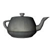
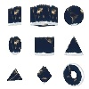

# webgpu-test
Test of WebGPU

|Library                                                                                                                                                         |                                                          |                                                             |                                                           |                                                      |                                                       |                                                |                                                  |
|:---------------------------------------------------------------------------------------------------------------------------------------------------------------|:-------------------------------------------------------------------------------------------:|:--------------------------------------------------------------------------------------------:|:----------------------------------------------------------------------------------------:|:--------------------------------------------------------------------------------------:|:---------------------------------------------------------------------------------------:|:----------------------------------------------------------------------------------:|:----------------------------------------------------------------------------------:|
|WebGPU (JS+GLSL)                                                                                                                                                |[Link](https://cx20.github.io/webgpu-test/examples/webgpu_glsl/triangle/index.html)          |[Link](https://cx20.github.io/webgpu-test/examples/webgpu_glsl/square/index.html)             |[Link](https://cx20.github.io/webgpu-test/examples/webgpu_glsl/cube/index.html)           |[Link](https://cx20.github.io/webgpu-test/examples/webgpu_glsl/texture/index.html)      |[Link](https://cx20.github.io/webgpu-test/examples/webgpu_glsl/teapot/index.html)        |                                                                                    |                                                                                    |
|WebGPU (JS+WGSL)                                                                                                                                                |[Link](https://cx20.github.io/webgpu-test/examples/webgpu_wgsl/triangle/index.html)          |[Link](https://cx20.github.io/webgpu-test/examples/webgpu_wgsl/square/index.html)             |[Link](https://cx20.github.io/webgpu-test/examples/webgpu_wgsl/cube/index.html)           |[Link](https://cx20.github.io/webgpu-test/examples/webgpu_wgsl/texture/index.html)      |[Link](https://cx20.github.io/webgpu-test/examples/webgpu_wgsl/teapot/index.html)        |                                                                                    |                                                                                    |
|WebGPU (TS+WGSL)                                                                                                                                                |[Link](https://cx20.github.io/webgpu-test/examples/typescript/triangle/index.html)           |[Link](https://cx20.github.io/webgpu-test/examples/typescript/square/index.html)              |[Link](https://cx20.github.io/webgpu-test/examples/typescript/cube/index.html)            |[Link](https://cx20.github.io/webgpu-test/examples/typescript/texture/index.html)       |[Link](https://cx20.github.io/webgpu-test/examples/typescript/teapot/index.html)         |                                                                                    |                                                                                    |
|WASM (Cpp+WGSL)                                                                                                                                                 |[Link](https://cx20.github.io/webgpu-test/examples/wasm_cpp/triangle/index.html)  (WIP)      |[Link](https://cx20.github.io/webgpu-test/examples/wasm_cpp/square/index.html)  (WIP)         |                                                                                          |                                                                                        |                                                                                         |                                                                                    |                                                                                    |
|[WASM (Rust+WGSL)](https://github.com/gfx-rs/wgpu/tree/trunk/wgpu)                                                                                              |[Link](https://cx20.github.io/webgpu-test/examples/rust/triangle/index.html) (WIP)           |[Link](https://cx20.github.io/webgpu-test/examples/rust/square/index.html) (WIP)              |                                                                                          |                                                                                        |                                                                                         |                                                                                    |                                                                                    |
|[webgpu-utils](https://github.com/greggman/webgpu-utils)                                                                                                        |[Link](https://cx20.github.io/webgpu-test/examples/webgpu-utils/triangle/index.html) (WIP)   |[Link](https://cx20.github.io/webgpu-test/examples/webgpu-utils/square/index.html) (WIP)      |[Link](https://cx20.github.io/webgpu-test/examples/webgpu-utils/cube/index.html) (WIP)    |                                                                                        |                                                                                         |                                                                                    |                                                                                    |
|[Babylon.js](https://doc.babylonjs.com/setup/support/webGPU)                                                                                                    |[Link](https://cx20.github.io/webgpu-test/examples/babylonjs/triangle/index.html)            |[Link](https://cx20.github.io/webgpu-test/examples/babylonjs/square/index.html)               |[Link](https://cx20.github.io/webgpu-test/examples/babylonjs/cube/index.html)             |[Link](https://cx20.github.io/webgpu-test/examples/babylonjs/texture/index.html)        |[Link](https://cx20.github.io/webgpu-test/examples/babylonjs/teapot/index.html)          |[Link](https://cx20.github.io/webgpu-test/examples/babylonjs/primitive/index.html)  |[Link](https://cx20.github.io/webgpu-test/examples/babylonjs/complex/index.html)    |
|[Babylon.js](https://doc.babylonjs.com/setup/support/webGPU) (using WGSL)                                                                                       |[Link](https://cx20.github.io/webgpu-test/examples/babylonjs_wgsl/triangle/index.html)       |[Link](https://cx20.github.io/webgpu-test/examples/babylonjs_wgsl/square/index.html)          |[Link](https://cx20.github.io/webgpu-test/examples/babylonjs_wgsl/cube/index.html)        |[Link](https://cx20.github.io/webgpu-test/examples/babylonjs_wgsl/texture/index.html)   |[Link](https://cx20.github.io/webgpu-test/examples/babylonjs_wgsl/teapot/index.html)     |                                                                                    |                                                                                    |
|[RedGPU](https://github.com/redcamel/RedGPU)                                                                                                                    |[Link](https://cx20.github.io/webgpu-test/examples/redgpu/triangle/index.html)               |[Link](https://cx20.github.io/webgpu-test/examples/redgpu/square/index.html)                  |[Link](https://cx20.github.io/webgpu-test/examples/redgpu/cube/index.html)                |[Link](https://cx20.github.io/webgpu-test/examples/redgpu/texture/index.html)           |[Link](https://cx20.github.io/webgpu-test/examples/redgpu/teapot/index.html)             |                                                                                    |                                                                                    |
|[three.js](https://github.com/mrdoob/three.js/) + [WebGPURenderer](https://github.com/mrdoob/three.js/blob/dev/build/three.webgpu.js)                           |[Link](https://cx20.github.io/webgpu-test/examples/threejs/triangle/index.html)              |[Link](https://cx20.github.io/webgpu-test/examples/threejs/square/index.html)                 |[Link](https://cx20.github.io/webgpu-test/examples/threejs/cube/index.html)               |[Link](https://cx20.github.io/webgpu-test/examples/threejs/texture/index.html)          |[Link](https://cx20.github.io/webgpu-test/examples/threejs/teapot/index.html)            |[Link](https://cx20.github.io/webgpu-test/examples/threejs/primitive/index.html)    |[Link](https://cx20.github.io/webgpu-test/examples/threejs/complex/index.html)      |
|[Hilo3d](https://github.com/06wj/WebGPU-Playground)                                                                                                             |[Link](https://cx20.github.io/webgpu-test/examples/hilo3d/triangle/index.html)               |[Link](https://cx20.github.io/webgpu-test/examples/hilo3d/square/index.html)                  |[Link](https://cx20.github.io/webgpu-test/examples/hilo3d/cube/index.html)                |                                                                                        |                                                                                         |                                                                                    |                                                                                    |
|[PlayCanvas](https://github.com/playcanvas/engine/tree/main/src/platform/graphics/webgpu)                                                                       |                                                                                             |                                                                                              |                                                                                          |[Link](https://cx20.github.io/webgpu-test/examples/playcanvas/texture/index.html)       |                                                                                         |                                                                                    |                                                                                    |
|[Rhodonite](https://github.com/actnwit/RhodoniteTS)                                                                                                             |[Link](https://cx20.github.io/webgpu-test/examples/rhodonite/triangle/index.html) (WIP)      |                                                                                              |                                                                                          |                                                                                        |                                                                                         |                                                                                    |                                                                                    |
